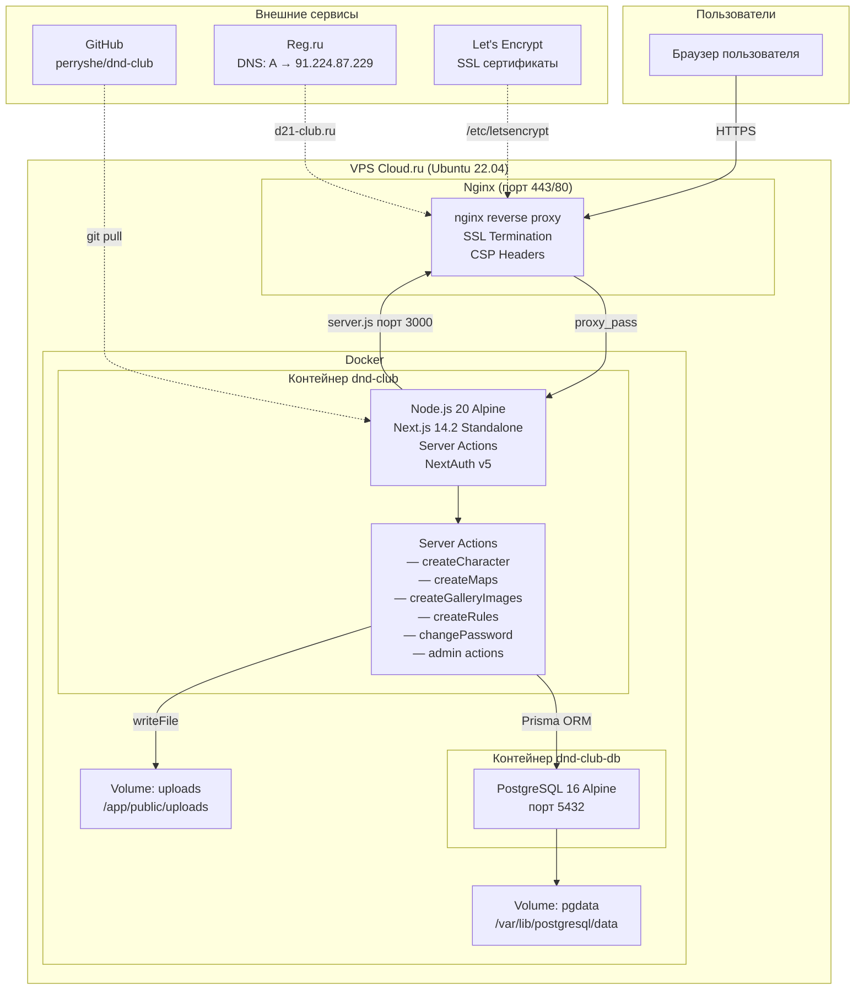
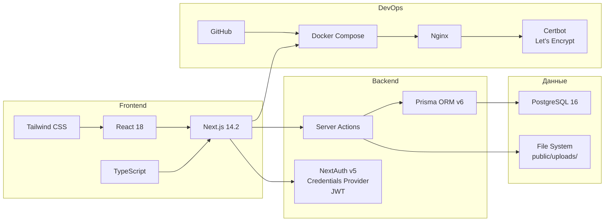
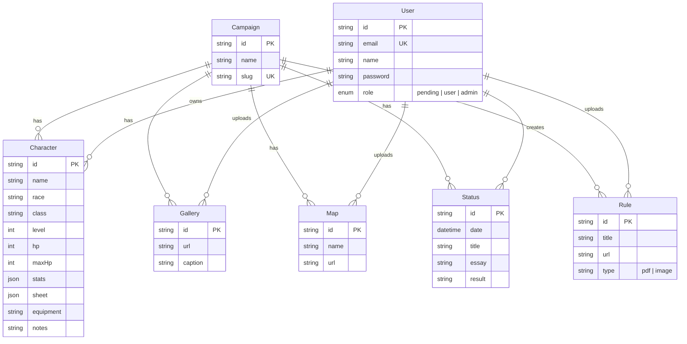
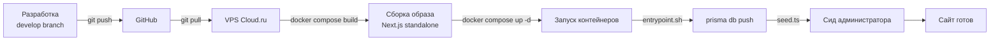
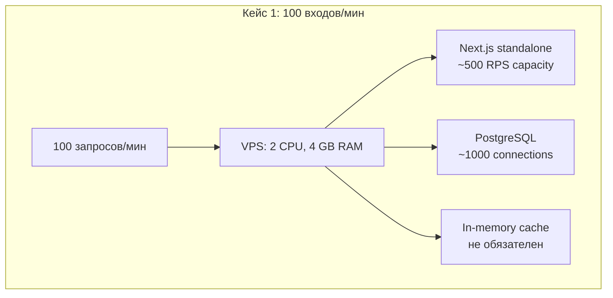
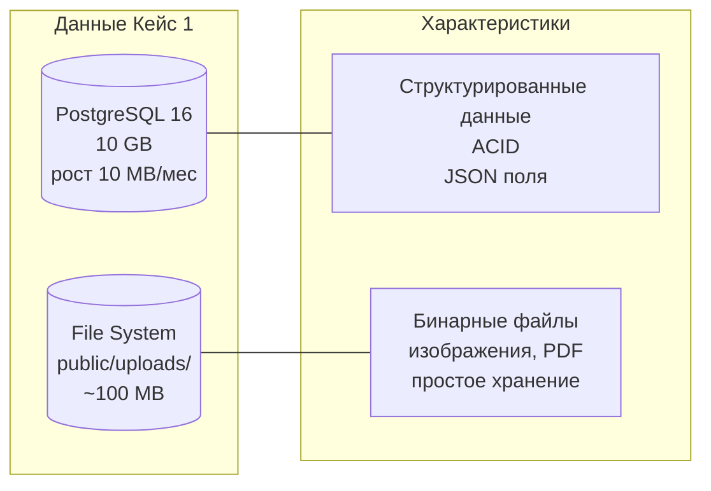
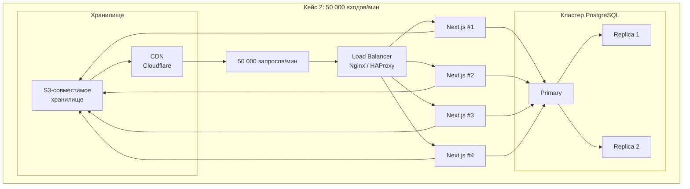
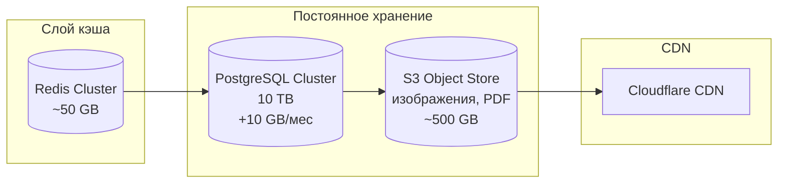

# Инфраструктура сайта ДНД Клуб (d21-club.ru)

## 0. Решаемая задача

Создание веб-сайта для настольной ролевой игры (D&D 5e и Cyberpunk RED) с функциями:

- **Публичный информационный портал** — главная страница с описанием клуба, ссылками на кампании и Telegram-канал
- **Мультикампанийность** — две независимые кампании («The Dead Band» и «Shards of Night City») с собственными персонажами, летописью, картами, правилами и галереей
- **Управление персонажами** — создание, редактирование, просмотр полноценных D&D 5e листов персонажей (характеристики, навыки, спасброски, заклинания, атаки, снаряжение, заметки)
- **Авторизация и роли** — регистрация с одобрением администратора, JWT-сессии, роли (pending → user → admin)
- **Летопись сессий** — хронология игровых встреч с датой, описанием и результатами
- **Медиаконтент** — загрузка и просмотр карт, изображений галереи, правил (PDF/изображения) через лайтбокс
- **Администрирование** — панель управления пользователями (одобрение/отклонение регистраций) и всем контентом каждой кампании
- **Смена пароля** — самостоятельное изменение пароля пользователем

### Функциональные требования к инфраструктуре

| Требование | Реализация |
|-----------|-----------|
| Веб-сервер с SSL | Nginx + Let's Encrypt (Certbot) |
| Server-side rendering | Next.js 14.2 App Router |
| Персистентное хранение данных | PostgreSQL 16 + Docker volume |
| Хранение загружаемых файлов | Файловая система (public/uploads/) + Docker volume |
| Аутентификация | NextAuth v5 (Credentials, JWT) |
| Защита от регистрационного спама | Rate limiter (3 запроса/час/IP) |
| Контейнеризация | Docker + Docker Compose |
| CI/CD | git push → git pull → docker compose build/up |
| Домен и DNS | d21-club.ru, reg.ru, A-запись |

## 1. Текущая архитектура

## 2. Стек технологий

## 3. Схема данных (упрощённая ERD)

## 4. CI/CD Pipeline

## 5. Анализ кейсов

### Кейс 1. Низкая нагрузка (до 100 входов/мин)

#### 5.1.1 Вид серверного обслуживания

**Уместен: выделенный виртуальный сервер (VPS) среднего уровня.**

Текущее решение на VPS Cloud.ru (1-2 vCPU, 2-4 GB RAM) полностью покрывает нагрузку 100 входов/мин. Next.js в режиме standalone обрабатывает ~500-1000 RPS на одном ядре. PostgreSQL 16 на Alpine держит тысячи одновременных соединений. Docker Compose обеспечивает изоляцию сервисов при минимальных накладных расходах.

**Альтернатива**: Vitual Private Server (VPS) или Dedicated Server. VPS достаточно.

**Почему не Serverless**: при 100 входах/мин Serverless (Vercel, Lambda) создаёт задержки холодного старта (cold start ~1-5 сек для Next.js) и не даёт преимуществ в цене. VPS фиксированной стоимостью выгоднее.

**Вывод**: Текущая инфраструктура (VPS + Docker Compose) оптимальна. Дополнительное масштабирование не требуется.

#### 5.1.2 Базы данных и СУБД

**Уместна: PostgreSQL 16 (реляционная СУБД) + файловая система для изображений.**

Обоснование:
- 10 GB с приростом 0,1%/мес = ~10 MB/мес = ~120 MB/год. За 10 лет — ~11,2 GB. PostgreSQL справляется без шардирования.
- Данные строго структурированы (пользователи, персонажи, статусы, правила) — реляционная модель идеальна.
- Требуются ACID-транзакции (создание персонажа, регистрация).
- JSON-поля в PostgreSQL (stats, sheet) позволяют хранить гибкие D&D-данные без отдельной NoSQL БД.
- Файлы изображений хранятся на файловой системе, в БД — только URL. Это стандартная практика.

**Почему не NoSQL**: данные высокоструктурированны, есть связи между таблицами (User→Character→Campaign). NoSQL (MongoDB) не даст преимуществ, но усложнит запросы с join.

**Почему не MySQL/PostgreSQL**: PostgreSQL выбран из-за лучшей поддержки JSON(B), более богатых типов данных и лучшей производительности под Docker на Alpine.

**Вывод**: PostgreSQL 16 + файловая система — оптимальный выбор. Миграции через Prisma ORM.

#### 5.1.3 Дополнительные технологии

**Не обязательны, но рекомендованы:**

| Технология | Нужна? | Почему |
|-----------|--------|--------|
| CDN (Cloudflare) | Опционально | Ускорит раздачу статики (изображения). Бесплатный план покроет нагрузку |
| Redis/Memcached | Нет | 100 входов/мин не создают нагрузки на БД. Кэширование избыточно |
| Load Balancer | Нет | Одна реплика приложения. Nginx уже выполняет reverse proxy |
| Мониторинг (Prometheus+Grafana) | Опционально | Для отслеживания здоровья сервера, но не критично |
| Бэкапы | **Да** | Необходимы: PostgreSQL pg_dump по расписанию + бэкап uploads |
| WAF/IDPS | Опционально | Nginx + fail2ban достаточно для 100 запросов/мин |

**Безопасность**:
- HTTPS (Certbot/Let's Encrypt) ✅ — есть
- CSP Headers ✅ — есть
- Rate limiter (3 регистрации/час/IP) ✅ — есть
- JWT с trustHost ✅ — есть
- bcrypt для паролей ✅ — есть

**Вывод**: Основные требования безопасности выполнены. Единственное улучшение — настроить автоматические бэкапы PostgreSQL и uploads.

#### 5.1.4 Роли исполнителей

| Роль | Необходимость | Задачи |
|------|--------------|--------|
| **Fullstack-разработчик** | 1 человек | Next.js, TypeScript, Tailwind, Prisma, Server Actions |
| **DevOps-инженер** | 0,5 ставки | Docker, Nginx, CI/CD, бэкапы, мониторинг |
| **Администратор БД** | Не нужен | PostgreSQL 16 не требует отдельного админа при таком объёме |

**Вывод**: Для проекта достаточно 1 fullstack-разработчика с базовыми навыками DevOps. Аутсорсинг DevOps (настройка сервера, Docker) — разовая задача.

---

### Кейс 2. Высокая нагрузка (50 000 входов/мин)

#### 5.2.1 Вид серверного обслуживания

**Уместен: кластер из нескольких серверов с балансировщиком нагрузки.**

50 000 входов/мин ≈ 833 RPS. Next.js способен обработать ~500-1000 RPS на одном ядре. Требуется горизональное масштабирование:

- 3-4 реплики Next.js за балансировщиком (Nginx, HAProxy или Cloudflare Load Balancer)
- Выделенный кластер PostgreSQL (Patroni + 2-3 реплики)
- CDN для статики (Cloudflare, CloudFront)
- Docker Swarm или Kubernetes для оркестрации

**Вывод**: VPS заменяется на кластер. Docker Compose → Kubernetes или Docker Swarm. Обязателен Load Balancer и CDN.

#### 5.2.2 Базы данных и СУБД

**Требуется: PostgreSQL 16 с шардированием + Redis Cache + объектное хранилище.**

10 TB с приростом 0,1%/мес = ~10 GB/мес = ~120 GB/год.

| Компонент | Решение | Обоснование |
|-----------|---------|-------------|
| **Основная БД** | PostgreSQL 16 + Patroni (кластер) | Реляционные данные, ACID, поддержка JSON. Patroni обеспечит автоматический failover |
| **Кэш** | Redis Cluster | Кэширование частых запросов (список персонажей, статусы). Снижает нагрузку на PostgreSQL |
| **Объектное хранилище** | MinIO / AWS S3 / Yandex Object Storage | Изображения и PDF больше не хранятся на файловой системе. S3-совместимое хранилище масштабируется горизонтально |
| **CDN** | Cloudflare / AWS CloudFront | Кэширование статики географически близко к пользователям |
| **Репликация** | Patroni + pgBouncer | Patroni управляет репликацией, pgBouncer — пул соединений |
| **Миграции** | Prisma ORM | Может потребоваться отказ от Prisma в пользу raw SQL для сложных миграций на больших данных |

**Вывод**: PostgreSQL остаётся, но с кластеризацией. Добавляется Redis, S3-хранилище и CDN. Возможно рассмотреть YugabyteDB/CockroachDB для горизонтального масштабирования SQL, но для 10 TB PostgreSQL справляется.

#### 5.2.3 Дополнительные технологии

**Обязательны:**

| Технология | Зачем |
|-----------|-------|
| **Kubernetes / Docker Swarm** | Оркестрация контейнеров, автоскейлинг, rolling updates |
| **Load Balancer (Nginx/HAProxy)** | Распределение трафика между репликами |
| **CDN (Cloudflare)** | Геораспределённая раздача статики, DDoS-защита |
| **Redis Cluster** | Кэширование, сессии, rate limiting |
| **S3 Object Storage** | Масштабируемое хранение файлов |
| **Patroni + etcd** | Управление кластером PostgreSQL, автоматический failover |
| **pgBouncer** | Пул соединений к PostgreSQL |
| **Prometheus + Grafana** | Мониторинг всех компонентов |
| **ELK / Grafana Loki** | Централизованный сбор логов |
| **HashiCorp Vault** | Управление секретами и паролями |
| **GitLab CI / GitHub Actions** | CI/CD pipeline с тестами и деплоем |
| **Terraform / Pulumi** | Infrastructure as Code для управления инфраструктурой |
| **Sentry** | Отслеживание ошибок в реальном времени |
| **Бэкапы + Disaster Recovery** | Регулярные бэкапы S3 + PostgreSQL + план восстановления |

**Безопасность:**
- WAF (Cloudflare) для защиты от DDoS и SQL-инъекций
- Network Policies в Kubernetes
- Регулярное обновление образов (Trivy/Snyk)
- Аудит доступа (IAM/RBAC)

**Вывод**: Инфраструктура усложняется в разы. Каждый компонент требует настройки и поддержки.

#### 5.2.4 Роли исполнителей

| Роль | Кол-во | Задачи |
|------|--------|--------|
| **Senior Fullstack-разработчик** | 2 | Next.js, TypeScript, оптимизация производительности |
| **DevOps-инженер** | 2 | K8s, CI/CD, Terraform, мониторинг |
| **Администратор БД (DBA)** | 1 | PostgreSQL кластер, Patroni, Redis, миграции |
| **Security-инженер** | 0,5 | Аудит безопасности, WAF, обновления |
| **QA-инженер** | 1 | Нагрузочное тестирование, интеграционные тесты |
| **Team Lead / Архитектор** | 1 | Координация, архитектурные решения |

**Вывод**: Команда минимум 5-6 человек. Ключевые роли — DevOps и DBA, которых не требовалось в Кейсе 1.

---

## 6. Сравнительная таблица кейсов

| Параметр | Кейс 1 (100/мин) | Кейс 2 (50 000/мин) |
|----------|------------------|---------------------|
| **Сервер** | 1 VPS (2 CPU, 4 GB) | Кластер (8+ CPU, 64+ GB) |
| **Оркестрация** | Docker Compose | Kubernetes / Docker Swarm |
| **Балансировка** | Nginx reverse proxy | HAProxy / Cloudflare LB |
| **База данных** | PostgreSQL 16 single | PostgreSQL cluster + Patroni |
| **Кэш** | Не нужен | Redis Cluster |
| **Файлы** | Файловая система | S3 + CDN |
| **Мониторинг** | Опционально | Обязателен (Prometheus + Grafana) |
| **CI/CD** | git pull + docker compose | GitLab CI + K8s rolling update |
| **Безопасность** | Базовый (HTTPS, CSP, rate limit) | WAF, IAM, Vault, сетевые политики |
| **Команда** | 1 fullstack | 5-6 специалистов |
| **Бюджет (мес)** | ~1500-3000 руб | ~100 000-300 000 руб |

## 7. Выводы

### Кейс 1: Нагрузка до 100 входов/мин

**Текущая архитектура полностью удовлетворяет требованиям.** VPS Cloud.ru с Docker Compose, PostgreSQL 16 и Next.js standalone — это современный, поддерживаемый стек, который без изменений выдержит заявленную нагрузку. Единственные рекомендованные улучшения:
- Настроить автоматические бэкапы (pg_dump + копирование uploads)
- Добавить бесплатный CDN (Cloudflare) для ускорения загрузки изображений

**Масштабирование в будущем**: при росте до ~1000 входов/мин достаточно увеличить ресурсы VPS (vertical scaling). Docker Compose упрощает миграцию на кластер при необходимости.

### Кейс 2: Нагрузка до 50 000 входов/мин

**Требуется полная перестройка инфраструктуры.** Переход от монолитного VPS к кластеру с балансировщиком, PostgreSQL кластером, Redis, S3, CDN и оркестрацией (Kubernetes). Стоимость инфраструктуры и команды возрастает на 1-2 порядка. Текущий стек (Next.js + PostgreSQL) остаётся ядром, но обрастает десятком дополнительных сервисов.

Ключевые изменения:
- Docker Compose → Kubernetes (управление репликами, автоскейлинг, rolling updates)
- Файловая система → S3 + CDN (масштабируемое хранение и доставка изображений)
- PostgreSQL single → Patroni кластер (отказоустойчивость)
- Добавление Redis для кэширования и сессий
- Полный мониторинг и централизованные логи

Порог перехода: при достижении ~1000-2000 входов/мин стоит начинать миграцию на кластерную архитектуру.
