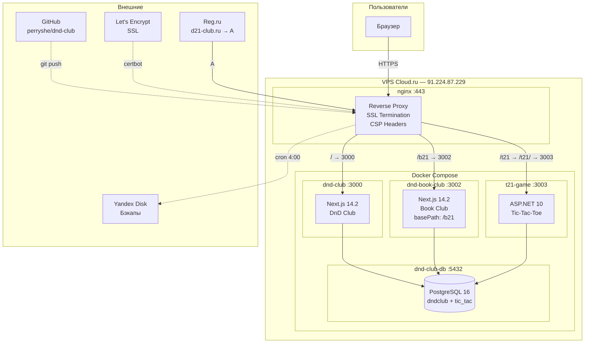
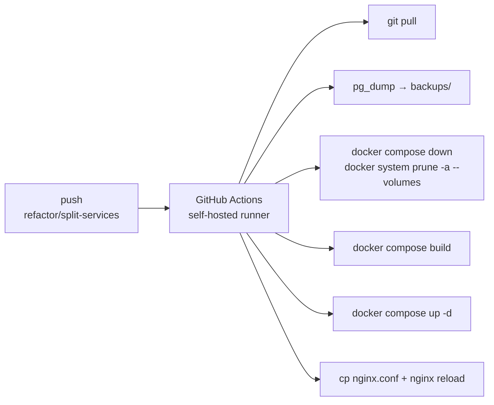

# d21-club.ru — DnD Club

Три микросервиса под одним доменом:

| Сервис | Путь | Стек | Назначение |
|--------|------|------|-----------|
| **DnD Club** | `/` | Next.js 14.2 (порт 3000) | Кампании, персонажи, карты, галерея, летопись |
| **Book Club** | `/b21` | Next.js 14.2 (порт 3002) | Книжный клуб |
| **Tic-Tac-Toe** | `/t21` | ASP.NET 10 (порт 3003) | Крестики-нолики против компьютера |

---

## Инфраструктура

### Архитектура



### Маршрутизация nginx

```nginx
/    → proxy_pass http://localhost:3000;   # DnD Club
/b21  → proxy_pass http://localhost:3002;   # Book Club (basePath: /b21)
/t21/ → proxy_pass http://localhost:3003/;  # Tic-Tac-Toe (со слешем)
/t21  → return 302 /t21/;                   # редирект без слеша
```

Конфиг: `dnd-club-nginx.conf` → `/etc/nginx/sites-enabled/dnd-club`.

### Компоненты

| Компонент | Технология | Версия |
|-----------|-----------|--------|
| Reverse proxy | nginx | 1.18 (Ubuntu) |
| Контейнеризация | Docker + Compose | plugin |
| База данных | PostgreSQL | 16 Alpine |
| DnD Club | Next.js (standalone) | 14.2 |
| Book Club | Next.js (standalone) | 14.2 |
| Tic-Tac-Toe | ASP.NET | 10 |
| ORM (DnD/Book) | Prisma | 6 |
| ORM (t21) | Entity Framework | 10 |
| SSL | Let's Encrypt (Certbot) | snap |
| CI/CD | GitHub Actions | self-hosted runner |

### База данных

Один инстанс PostgreSQL, три базы:

| База | Владелец | Используется | ORM |
|------|---------|-------------|-----|
| `dndclub` | dndclub | DnD Club + Book Club | Prisma |
| `tic_tac` | dndclub | Tic-Tac-Toe | EF Core |
| `postgres` | dndclub | системная (админ) | — |

Создаются автоматически через `postgres/init.sql` при первом запуске контейнера db.

### CI/CD Pipeline



Workflow: `.github/workflows/deploy-v2.yml`.

---

## Бэкапы

### Расписание

Ежедневно в **4:00 MSK** (cron пользователя `club`):

```bash
0 4 * * * docker exec dnd-club-db pg_dump -U dndclub dndclub | gzip > backups/dndclub-$(date +\%Y\%m\%d).sql.gz && docker exec dnd-club-db pg_dump -U dndclub tic_tac | gzip > backups/tic_tac-$(date +\%Y\%m\%d).sql.gz && find backups -name '*.sql.gz' -mtime +7 -delete && rclone sync uploads yadisk:club-backup/uploads >/dev/null 2>&1 && rclone sync backups yadisk:club-backup/backups >/dev/null 2>&1
```

1. **pg_dump** обеих БД → gzip → `backups/`
2. Удаление локальных дампов старше **7 дней**
3. **rclone sync** uploads → `yadisk:club-backup/uploads`
4. **rclone sync** backups → `yadisk:club-backup/backups`

### Пред-деплойный бэкап

Перед `docker system prune --volumes` в CI/CD выполняется pg_dump обеих БД с меткой времени:

```
backups/dndclub-20260609_115800.sql.gz
backups/tic_tac-20260609_115800.sql.gz
```

### Восстановление

```bash
gunzip -c backups/dndclub-20260609.sql.gz | docker exec -i dnd-club-db psql -U dndclub dndclub
gunzip -c backups/tic_tac-20260609.sql.gz | docker exec -i dnd-club-db psql -U dndclub tic_tac
```

---

## Деплой

### Автоматический (CI/CD)

**Триггер:** push в ветку `refactor/split-services`.

> Правки только `.md` файлов деплой **не запускают** (`paths-ignore`).

Что происходит на сервере:

1. `git pull origin refactor/split-services`
2. `pg_dump` dndclub + tic_tac → `backups/` (с префиксом даты)
3. Очистка дампов старше 7 дней
4. `docker compose -f docker-compose.prod.yml down --remove-orphans`
5. `docker system prune -a --volumes -f`
6. `docker compose -f docker-compose.prod.yml build`
7. `docker compose -f docker-compose.prod.yml up -d`
8. `cp dnd-club-nginx.conf → sudo nginx -t && sudo systemctl reload nginx`

> ⚠️ **Шаг 5 уничтожает ВСЕ volumes — БД (pgdata) и загруженные файлы (uploads).**  
> Шаг 2 — единственная гарантия сохранности данных. При первом запуске БД пустая — не критично.

### Первый запуск (с нуля)

```bash
ssh root@91.224.87.229

# Установка Docker, Nginx, Certbot (если не установлены)
# или запустить setup.sh

cd /root
git clone https://github.com/perryshe/dnd-club.git
cd dnd-club

docker compose -f docker-compose.prod.yml build
docker compose -f docker-compose.prod.yml up -d

# Настроить nginx
cp dnd-club-nginx.conf /etc/nginx/sites-enabled/dnd-club
nginx -t && systemctl restart nginx

# SSL (если ещё не получен)
certbot --nginx -d d21-club.ru -d www.d21-club.ru
```

После запуска — admin-доступ:
- **Email:** admin@dnd-club.ru
- **Пароль:** admin123

> Смените пароль после первого входа.

### Ручное обновление

```bash
ssh club@91.224.87.229
cd /home/club/Club

git pull origin refactor/split-services

# Бэкап на всякий случай
mkdir -p backups
docker exec dnd-club-db pg_dump -U dndclub dndclub | gzip > backups/pre-update-dndclub.sql.gz
docker exec dnd-club-db pg_dump -U dndclub tic_tac | gzip > backups/pre-update-tic_tac.sql.gz

docker compose -f docker-compose.prod.yml down
docker compose -f docker-compose.prod.yml build
docker compose -f docker-compose.prod.yml up -d
```

### Обновление nginx отдельно

```bash
sudo cp /home/club/Club/dnd-club-nginx.conf /etc/nginx/sites-enabled/dnd-club
sudo nginx -t && sudo systemctl reload nginx
```

### Откат (rollback)

```bash
cd /home/club/Club
git checkout <stable-commit-hash>
docker compose -f docker-compose.prod.yml build
docker compose -f docker-compose.prod.yml up -d
```

### Полезные команды

```bash
# Статус контейнеров
docker ps --format "table {{.Names}}\t{{.Status}}"

# Логи
docker logs dnd-club --tail 50
docker logs dnd-book-club --tail 50
docker logs t21-game --tail 50
docker logs dnd-club-db --tail 50

# Перезапуск одного сервиса
docker compose -f docker-compose.prod.yml restart dnd-club

# Зайти в базу
docker exec -it dnd-club-db psql -U dndclub -d dndclub

# SQL-запрос напрямую
docker exec -it dnd-club-db psql -U dndclub -d dndclub -c "SELECT count(*) FROM users;"

# Очистка всего (осторожно!)
docker compose -f docker-compose.prod.yml down -v
docker system prune -a --volumes -f
```

---

## Файлы проекта

| Файл | Назначение |
|------|-----------|
| `docker-compose.prod.yml` | Production Compose: db, dnd-club, book-club, t21-game |
| `dnd-club-nginx.conf` | Reverse proxy конфиг nginx |
| `postgres/init.sql` | Создание баз tic_tac и bookclub при первом запуске |
| `.github/workflows/deploy-v2.yml` | CI/CD pipeline (push → деплой) |
| `setup.sh` | Скрипт первичной настройки сервера |
| `docker-entrypoint.sh` | Entrypoint контейнера: prisma generate → db push → seed → старт |
| `uploads/` | Загруженные пользователями файлы (bind mount) |
| `backups/` | Дампы БД (создаётся cron + workflow) |
| `apps/dnd-club/` | Исходники DnD Club |
| `apps/book-club/` | Исходники Book Club |
| `apps/tic-tac/` | Исходники Tic-Tac-Toe (.NET) |
