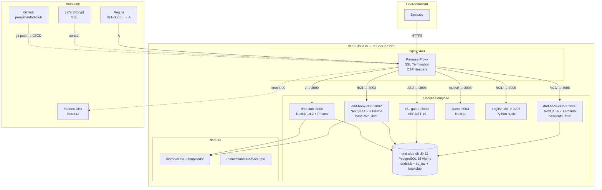
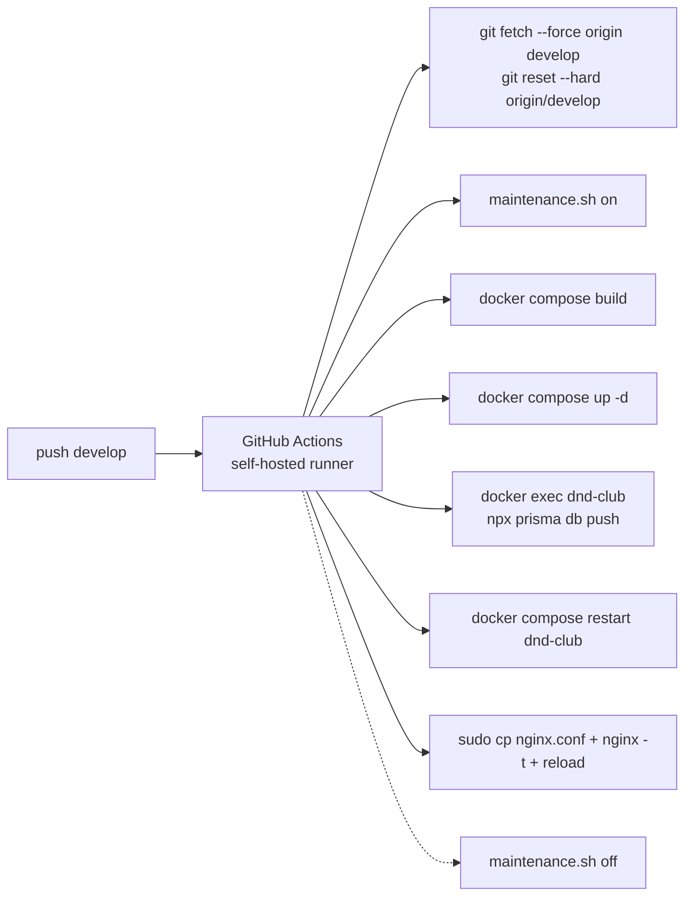

# d21-club.ru — DnD Club

Семь микросервисов под одним доменом, одна БД PostgreSQL.

| Сервис | Путь | Порт | Стек | Назначение |
|--------|------|------|------|-----------|
| **DnD Club** | `/` | 3000 | Next.js 14.2 + Prisma | Кампании, персонажи, карты, галерея, летопись, книжные события |
| **Book Club v1** | `/b21` | 3002 | Next.js 14.2 + Prisma | Книжный клуб (старый) |
| **Book Club v2** | `/b22` | 3006 | Next.js 14.2 + Prisma | Книжный клуб (новый, sadmin only) |
| **Tic-Tac-Toe** | `/t21` | 3003 | ASP.NET 10 + EF Core | Крестики-нолики против компьютера |
| **Quest** | `/quest` | 3004 | Next.js (Quest) | Квест-приложение |
| **English** | `/e21` | 3005 | Python (статический сайт) | Английский язык (sadmin only) |
| **PostgreSQL** | — | 5432 | PostgreSQL 16 Alpine | Общая БД для всех сервисов |

---

## Инфраструктура

### Архитектура


```mermaid
graph TB
    subgraph "Пользователи"
        U[Браузер]
    end

    subgraph "VPS Cloud.ru — 91.224.87.229"
        subgraph "nginx :443"
            NG[Reverse Proxy<br/>SSL Termination<br/>CSP Headers]
        end

        subgraph "Docker Compose"
            NX1["dnd-club :3000<br/>Next.js 14.2 + Prisma"]
            NX2["dnd-book-club :3002<br/>Next.js 14.2 + Prisma<br/>basePath: /b21"]
            NX3["t21-game :3003<br/>ASP.NET 10"]
            NX4["quest :3004<br/>Next.js"]
            NX5["english :80 -> 3005<br/>Python static"]
            NX6["dnd-book-club-2 :3006<br/>Next.js 14.2 + Prisma<br/>basePath: /b22"]
            PG[("dnd-club-db :5432<br/>PostgreSQL 16 Alpine<br/>dndclub + tic_tac + bookclub")]
        end

        subgraph "Файлы"
            UPL["/home/club/Club/uploads/"]
            BAK["/home/club/Club/backups/"]
        end
    end

    subgraph "Внешние"
        GH[GitHub<br/>perryshe/dnd-club]
        DNS[Reg.ru<br/>d21-club.ru → A]
        LE[Let's Encrypt<br/>SSL]
        YD[Yandex Disk<br/>Бэкапы]
    end

    U -->|HTTPS| NG
    NG -->|/ → 3000| NX1
    NG -->|/b21 → 3002| NX2
    NG -->|/b22/ → 3006| NX6
    NG -->|/t21/ → 3003| NX3
    NG -->|/quest/ → 3004| NX4
    NG -->|/e21/ → 3005| NX5
    NX1 --> PG
    NX2 --> PG
    NX3 --> PG
    NX6 --> PG
    NX1 --> UPL
    NX2 --> UPL
    GH -.->|git push → CI/CD| NG
    LE -.->|certbot| NG
    DNS -->|A| NG
    NG -.->|cron 4:00| YD
```

### Маршрутизация nginx

```nginx
/         → proxy_pass http://localhost:3000;    # DnD Club
/b21      → proxy_pass http://localhost:3002;    # Book Club v1
/b22/     → auth_request → proxy_pass :3006;    # Book Club v2 (sadmin only)
/t21/     → proxy_pass http://localhost:3003/;   # Tic-Tac-Toe
/quest/   → proxy_pass http://localhost:3004/;   # Quest
/e21/     → auth_request → proxy_pass :3005;    # English (sadmin only)
/uploads/ → alias /home/club/Club/uploads/;       # Файлы (30d cache)
```

Конфиг: [`dnd-club-nginx.conf`](./dnd-club-nginx.conf) → `/etc/nginx/sites-enabled/dnd-club`.

Внутренние эндпоинты аутентификации (auth_request):

| Endpoint | Прокси на | Проверяет |
|----------|-----------|-----------|
| `/_auth/check` | `:3000/api/auth/check-session` | Любая сессия |
| `/_auth/check-admin` | `:3000/api/auth/check-admin` | Роль `admin` |
| `/_auth/check-sadmin` | `:3000/api/auth/check-sadmin` | Роль `sadmin` |

При ошибке 401 отдаются статические страницы:
- `/b22-denied.html` — для `/b22/`
- `/e21-denied.html` — для `/e21/`

### Компоненты

| Компонент | Технология | Версия |
|-----------|-----------|--------|
| Reverse proxy | nginx | 1.18 (Ubuntu) |
| Контейнеризация | Docker + Compose plugin | — |
| База данных | PostgreSQL | 16 Alpine |
| DnD Club | Next.js (standalone) | 14.2 |
| Book Club v1 | Next.js (standalone) | 14.2 |
| Book Club v2 | Next.js (standalone) | 14.2 |
| Tic-Tac-Toe | ASP.NET | 10 |
| Quest | Next.js | — |
| English | Python | — |
| ORM (Next.js) | Prisma | 6 |
| ORM (t21) | Entity Framework | 10 |
| SSL | Let's Encrypt (Certbot) | snap |
| CI/CD | GitHub Actions | self-hosted runner |

### База данных

Один инстанс PostgreSQL, четыре базы данных:

| База | Владелец | ORM | Используется |
|------|---------|-----|-------------|
| `dndclub` | dndclub | Prisma | DnD Club + Book Club v1/v2 + Quest |
| `tic_tac` | dndclub | EF Core | Tic-Tac-Toe |
| `bookclub` | dndclub | — | (не используется) |
| `postgres` | dndclub | — | Системная / админ |

Базы создаются автоматически через [`postgres/init.sql`](./postgres/init.sql) при первом запуске контейнера db.

#### Схема `dndclub`

Таблицы управляемые Prisma (15 шт):

| Таблица | Модель Prisma | Сервис | Описание |
|---------|--------------|--------|----------|
| `users` | User | dnd-club, book-club, book-club-2 | Пользователи, роли |
| `campaigns` | Campaign | dnd-club | Кампании |
| `characters` | Character | dnd-club | Персонажи |
| `gallery` | Gallery | dnd-club | Галерея |
| `maps` | Map | dnd-club | Карты |
| `rules` | Rule | dnd-club | Правила/PDF |
| `statuses` | Status | dnd-club | Летопись (записи сессий) |
| `status_images` | StatusImage | dnd-club | Изображения летописи |
| `book_events` | BookEvent | dnd-club, book-club | Книжные события |
| `books` | Book | book-club, book-club-2 | Книги |
| `reviews` | Review | book-club, book-club-2 | Рецензии |
| `suggestions` | Suggestion | book-club, book-club-2 | Предложения книг |
| `votes` | Vote | book-club, book-club-2 | Голосования |
| `meetings` | Meeting | book-club, book-club-2 | Встречи |
| `read_progress` | ReadProgress | book-club, book-club-2 | Прогресс чтения |

Роль `sadmin` — супер-администратор, доступ к `/b22/` и `/e21/`. Назначается вручную через БД.

### CI/CD Pipeline

**Триггер:** push в ветку `develop` (кроме `*.md` файлов).

Workflow: [`.github/workflows/deploy-v2.yml`](./.github/workflows/deploy-v2.yml).


```mermaid
graph LR
    DEV[push develop] --> ACT[GitHub Actions<br/>self-hosted runner]
    ACT --> PULL[git fetch --force origin develop<br/>git reset --hard origin/develop]
    ACT --> MAINT[maintenance.sh on]
    ACT --> BUILD[docker compose build]
    ACT --> UP[docker compose up -d]
    ACT --> PUSH[docker exec dnd-club<br/>npx prisma db push]
    ACT --> RESTART[docker compose restart dnd-club]
    ACT --> NGINX[sudo cp nginx.conf + nginx -t + reload]
    ACT -.-> MAINT_OFF[maintenance.sh off]
```

> ⚠️ **CI/CD не удаляет volumes.** `pgdata` и `uploads` сохраняются между деплоями.  
> Раньше CI/CD выполнял `docker system prune --volumes` — **теперь нет** (сохранение данных критически важно).

### Аутентификация и роли

Система ролей на основе Prisma enum `Role`:

| Значение | Описание |
|----------|----------|
| `pending` | Ожидает подтверждения |
| `user` | Обычный пользователь |
| `admin` | Администратор |
| `sadmin` | Супер-администратор |

- Регистрация по пригласительной ссылке (hardcoded в компоненте регистрации)
- Проверка ролей через API эндпоинты (nginx auth_request):
  - `check-session` — любая валидная сессия
  - `check-admin` — роль `admin` или `sadmin`
  - `check-sadmin` — только `sadmin`

---

## Entrypoint'ы контейнеров

Entrypoint'ы выполняются при каждом старте контейнера. **Ни один entrypoint не запускает `prisma db push`** — схема БД управляется только CI/CD (dnd-club). Это предотвращает случайное удаление таблиц общих БД.

| Сервис | Entrypoint | Что делает |
|--------|-----------|-----------|
| dnd-club | [`apps/dnd-club/docker-entrypoint.sh`](./apps/dnd-club/docker-entrypoint.sh) | `prisma generate` → старт приложения |
| book-club | [`apps/book-club/docker-entrypoint.sh`](./apps/book-club/docker-entrypoint.sh) | `prisma generate` → seed → старт приложения |
| book-club-2 | [`apps/book-club-2/docker-entrypoint.sh`](./apps/book-club-2/docker-entrypoint.sh) | Старт приложения (Prisma Client генерится при сборке) |

## Бэкапы

### Расписание

Ежедневно в **4:00 MSK** (cron пользователя `club`):

```bash
0 4 * * * \
  docker exec dnd-club-db pg_dump -U dndclub dndclub | gzip \
    > /home/club/Club/backups/dndclub-$(date +\%Y\%m\%d).sql.gz \
  && docker exec dnd-club-db pg_dump -U dndclub tic_tac | gzip \
    > /home/club/Club/backups/tic_tac-$(date +\%Y\%m\%d).sql.gz \
  && find /home/club/Club/backups -name '*.sql.gz' -mtime +7 -delete \
  && rclone sync /home/club/Club/uploads yadisk:club-backup/uploads >/dev/null 2>&1 \
  && rclone sync /home/club/Club/backups yadisk:club-backup/backups >/dev/null 2>&1
```

Схема:
1. **pg_dump** обеих БД → gzip → `backups/`
2. Удаление локальных дампов старше **7 дней**
3. **rclone sync** uploads → `yadisk:club-backup/uploads`
4. **rclone sync** backups → `yadisk:club-backup/backups`

### Пред-деплойный бэкап

CI/CD не удаляет volumes, поэтому пред-деплойный бэкап больше не делается. Дампы за предыдущие дни лежат в `backups/`.

### Восстановление из дампа

```bash
# Полный сброс БД и восстановление из дампа
zcat /home/club/Club/backups/dndclub-YYYYMMDD.sql.gz | docker exec -i dnd-club-db psql -U dndclub dndclub
zcat /home/club/Club/backups/tic_tac-YYYYMMDD.sql.gz | docker exec -i dnd-club-db psql -U dndclub tic_tac
```

Если таблицы уже существуют — нужно очистить схему перед восстановлением:

```bash
echo 'DROP SCHEMA public CASCADE; CREATE SCHEMA public;' | docker exec -i dnd-club-db psql -U dndclub -d dndclub
zcat backups/dndclub-YYYYMMDD.sql.gz | docker exec -i dnd-club-db psql -U dndclub -d dndclub
```

После восстановления — добавить `sadmin` в enum (если в дампе его нет):

```sql
ALTER TYPE "Role" ADD VALUE 'sadmin';
UPDATE users SET role = 'sadmin' WHERE name = 'perryshe';
```

---

## Деплой

### Автоматический (CI/CD)

Триггер: push в ветку `develop`.

> Правки только `.md` файлов деплой не запускают (`paths-ignore`).

Что происходит на сервере:

1. `git fetch --force origin develop && git reset --hard origin/develop`
2. Копирование `maintenance.html` в nginx
3. `./maintenance.sh on` — включение режима обслуживания
4. `docker compose build` — сборка всех образов
5. `docker compose up -d` — старт всех контейнеров
6. Ожидание готовности БД (pg_isready)
7. `docker exec dnd-club npx prisma db push` — синхронизация схемы
8. `docker compose restart dnd-club` — перезапуск с новой схемой
9. `sudo cp nginx.conf && nginx -t && systemctl reload nginx` — обновление nginx
10. `./maintenance.sh off` — выключение режима обслуживания

### Первый запуск (с нуля)

```bash
ssh root@91.224.87.229

cd /root
git clone https://github.com/perryshe/dnd-club.git
cd dnd-club

docker compose -f docker-compose.prod.yml build
docker compose -f docker-compose.prod.yml up -d

# Настроить nginx
cp dnd-club-nginx.conf /etc/nginx/sites-enabled/dnd-club
nginx -t && systemctl restart nginx

# SSL
certbot --nginx -d d21-club.ru -d www.d21-club.ru
```

После запуска:
- Данные создаются через seed: admin пользователь, кампании, тестовые книги
- Admin-доступ: `admin@dnd-club.ru` / `admin123` (сменить после входа)

### Ручное обновление

```bash
ssh club@91.224.87.229
cd /home/club/Club

git pull origin develop

# Бэкап на всякий случай
docker exec dnd-club-db pg_dump -U dndclub dndclub | gzip > backups/pre-update-dndclub.sql.gz
docker exec dnd-club-db pg_dump -U dndclub tic_tac | gzip > backups/pre-update-tic_tac.sql.gz

docker compose -f docker-compose.prod.yml build
docker compose -f docker-compose.prod.yml up -d

# Синхронизация схемы
docker exec dnd-club npx prisma db push
docker compose restart dnd-club
```

### Maintenance mode

Показывает посетителям страницу с таймером обратного отсчёта (10 минут).

```bash
cd /home/club/Club
./maintenance.sh on     # включить
./maintenance.sh off    # выключить
./maintenance.sh status # проверить статус
```

### Обновление nginx отдельно

```bash
sudo cp /home/club/Club/dnd-club-nginx.conf /etc/nginx/sites-enabled/dnd-club
sudo nginx -t && sudo systemctl reload nginx
```

### Откат (rollback)

```bash
cd /home/club/Club
git checkout <stable-commit-hash>
docker compose -f docker-compose.prod.yml build
docker compose -f docker-compose.prod.yml up -d
docker exec dnd-club npx prisma db push
docker compose restart dnd-club
```

---

## Полезные команды

```bash
# Статус контейнеров
docker ps --format "table {{.Names}}\t{{.Image}}\t{{.Status}}\t{{.Ports}}"

# Логи
docker logs dnd-club --tail 50
docker logs dnd-book-club --tail 50
docker logs dnd-book-club-2 --tail 50
docker logs t21-game --tail 50
docker logs quest --tail 50
docker logs english --tail 50
docker logs dnd-club-db --tail 50

# Перезапуск одного сервиса
docker compose -f docker-compose.prod.yml restart dnd-club

# Зайти в базу
docker exec -it dnd-club-db psql -U dndclub -d dndclub

# SQL-запрос напрямую
docker exec -i dnd-club-db psql -U dndclub -d dndclub -c "SELECT count(*) FROM users;"

# SQL через echo (правильный quoting для Windows PowerShell):
'SELECT enum_range(NULL::public."Role");' | ssh club@91.224.87.229 "docker exec -i dnd-club-db psql -U dndclub -d dndclub"

# Работа с БД через скрипт-файл:
echo 'SQL here' > /tmp/q.sql; docker exec -i dnd-club-db psql -U dndclub -d dndclub -f /tmp/q.sql

# Чистка БД (сброс всех таблиц)
echo 'DROP SCHEMA public CASCADE; CREATE SCHEMA public;' | ssh club@91.224.87.229 "docker exec -i dnd-club-db psql -U dndclub -d dndclub"

# Очистка всего (осторожно — удалит pgdata!)
docker compose -f docker-compose.prod.yml down -v
docker system prune -a --volumes -f

# Список баз данных
docker exec dnd-club-db psql -U dndclub -d postgres -c '\l'

# Список таблиц в dndclub
docker exec dnd-club-db psql -U dndclub -d dndclub -c '\dt'

# Отладка book-club-2 (авторизация)
curl -I -k https://d21-club.ru/b22/
```

---

## Файлы проекта

| Файл | Назначение |
|------|-----------|
| `docker-compose.prod.yml` | Production Compose (7 сервисов) |
| `dnd-club-nginx.conf` | Reverse proxy конфиг nginx |
| `postgres/init.sql` | Создание баз tic_tac, bookclub при первом запуске |
| `maintenance.html` | Статическая страница с таймером для регламентных работ |
| `maintenance.sh` | Скрипт включения/выключения maintenance mode |
| `.github/workflows/deploy-v2.yml` | CI/CD pipeline (push → деплой) |
| `setup.sh` | Скрипт первичной настройки сервера |
| `apps/dnd-club/prisma/schema.prisma` | Полная схема Prisma (все таблицы dndclub) |
| `apps/dnd-club/docker-entrypoint.sh` | Entrypoint DnD Club |
| `apps/book-club/docker-entrypoint.sh` | Entrypoint Book Club v1 |
| `apps/book-club-2/docker-entrypoint.sh` | Entrypoint Book Club v2 |
| `apps/book-club/prisma/seed.ts` | Seed: admin, кампании, книги |
| `uploads/` | Загруженные пользователями файлы (bind mount, сохраняется между деплоями) |
| `backups/` | Дампы БД (создаются cron + cron чистит старше 7 дней) |
| `apps/dnd-club/` | Исходники DnD Club |
| `apps/book-club/` | Исходники Book Club v1 |
| `apps/book-club-2/` | Исходники Book Club v2 |
| `apps/tic-tac/` | Исходники Tic-Tac-Toe (.NET) |
| `apps/Quest/` | Исходники Quest |
| `apps/english/` | Исходники English |
| `apps/tic-tac+/` | Экспериментальная версия Tic-Tac-Toe |

---

## Правила

1. **Rollback:** при проблемах на сайте — откат до `stable` (git checkout → build → up -d → prisma db push → restart)
2. **Commit:** `fix:` / `feat:` / `cleanup:` / `docs:` — conventional commits, без заглавных букв, без пробелов
3. **Ветка:** `develop` — основная ветка разработки. `main` — стабильная (не используется активно)
4. **Prisma db push:** Только в CI/CD для dnd-club. **Никогда** в entrypoint'ах контейнеров — это может удалить таблицы других сервисов из общей БД
5. **Роль sadmin:** Не создаётся через регистрацию — только вручную через SQL

---

## История восстановления данных

**Проблема:** book-club-2 запускал `prisma db push --accept-data-loss` в entrypoint'е, что на каждом старте контейнера удаляло таблицы dnd-club из общей БД (campaigns, characters, gallery, maps, rules, statuses, status_images).

**Решение:**
1. Убран `--accept-data-loss` из всех entrypoint'ов (коммиты `0f34c98`, `b784b2f`)
2. БД восстановлена из дампа `dndclub-20260626.sql.gz`
3. После восстановления: `ALTER TYPE "Role" ADD VALUE 'sadmin'` и `UPDATE users SET role = 'sadmin' WHERE name = 'perryshe'`
4. Удалён ручной seed-скрипт `seed-heroes.ts` (больше не нужен — оригинальные персонажи в дампе)
