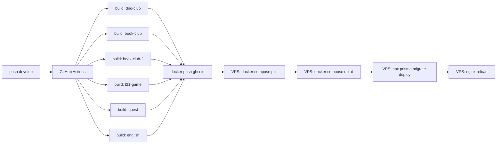

# Container Registry — миграция на готовые образы

> Перспективный план. Выполняется ПОСЛЕ основного чек-листа (`checklist.md`).
> Суть: билд в CI (GitHub Actions), образы в ghcr.io, на VPS только pull.
> Ветка: `audit` | Статус: подготовка

---

## Зачем

| Сейчас | После |
|---|---|
| VPS билдит Node 20 + .NET 10 SDK (тяжёлые слои) | VPS только тянет готовые образы |
| `docker compose build` на сервере (~5-8 мин) | `docker compose pull` (~30 сек) |
| Нет версионирования образов | Теги `:commit-sha`, `:latest` |
| Роллбэк = пересборка старого коммита | Роллбэк = `docker compose up -d` с предыдущим тегом |
| Простой при деплое до 10 мин | Простой — секунды |

---

## Реестр: GitHub Container Registry (ghcr.io)

- Репозиторий публичный → образы тоже публичные (бесплатно)
- Паттерн имени: `ghcr.io/perryshe/dnd-club/<service>:<tag>`

| Сервис | Образ |
|---|---|
| dnd-club | `ghcr.io/perryshe/dnd-club/dnd-club:latest` |
| book-club | `ghcr.io/perryshe/dnd-club/book-club:latest` |
| book-club-2 | `ghcr.io/perryshe/dnd-club/book-club-2:latest` |
| t21-game | `ghcr.io/perryshe/dnd-club/t21-game:latest` |
| quest | `ghcr.io/perryshe/dnd-club/quest:latest` |
| english | `ghcr.io/perryshe/dnd-club/english:latest` |

---

## Задачи

| # | Задача | Описание | Файлы | Готовность |
|---|---|---|---|---|
| 1 | **Токен доступа к ghcr.io** | Создать GitHub Personal Access Token с scope `write:packages`, `read:packages`. Добавить в Secrets репозитория как `GHCR_TOKEN` | GitHub → Settings → Developer settings → Personal access tokens → repo Secrets | ⬜ |
| 2 | **CI: логин и пуш образов** | Добавить в `deploy-v2.yml` шаги: login to ghcr.io, build всех 6 сервисов с тегом `:sha-{GITHUB_SHA}` и `:latest`, push в ghcr.io | `.github/workflows/deploy-v2.yml` | ⬜ |
| 3 | **VPS: логин в ghcr.io** | На сервере выполнить `docker login ghcr.io -u perryshe --password-stdin` с GHCR_TOKEN. Добавить `cron` или `systemd` для обновления токена (expire 90 дней) | VPS (через SSH) | ⬜ |
| 4 | **docker-compose: build → image** | Заменить все `build: ...` на `image: ghcr.io/perryshe/dnd-club/<service>:latest`. Убрать `build` секции, оставить `pull_policy: always` | `docker-compose.prod.yml` | ⬜ |
| 5 | **CI: деплой через pull** | Убрать `docker compose build` из CI. Вместо: `docker compose pull` + `docker compose up -d`. Оставить `restart dnd-club` после prisma | `.github/workflows/deploy-v2.yml` | ⬜ |
| 6 | **Миграция: первый push всех образов** | Один раз запустить `docker compose build` + `docker tag` + `docker push` для всех 6 сервисов, чтобы наполнить registry | Вручную или через CI trigger | ⬜ |
| 7 | **Версионирование и роллбэк** | Определить стратегию тегов (`:latest`, `:stable`, `:sha-abc123`). Написать скрипт роллбэка: `docker compose up -d` с предыдущей версией | `rollback.sh` (опционально) | ⬜ |
| 8 | **Документация** | Обновить README / ACCESS_MATRIX: описать новый процесс деплоя, как делать роллбэк, где живут образы | `README.md`, `ACCESS_MATRIX.md` | ⬜ |

---

## Схема нового CI/CD



---

## Порядок выполнения (зависимости)

```
Задача 1 (токен)
  ↓
Задача 2 (CI build+push)
  ↓
Задача 3 (VPS login)
  ↓
Задача 6 (первый push) ──── параллельно ──── Задача 4 (compose -> image)
  ↓
Задача 5 (CI deploy через pull)
  ↓
Задача 7 (версионирование)
  ↓
Задача 8 (документация)
```

---

**Статус:** ⬜ — не начато | ✅ — готово | 🔄 — в работе
