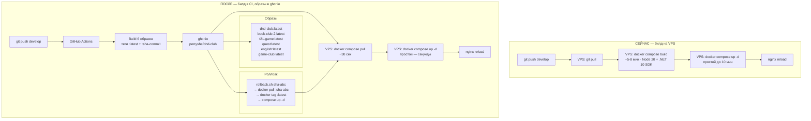

# Container Registry — миграция на готовые образы

> Перспективный план. Выполняется ПОСЛЕ основного чек-листа (`checklist.md`).
> Суть: билд в CI (GitHub Actions), образы в ghcr.io, на VPS только pull.
> Ветка: `audit` | Обновлён: 28.06.2026 (мерж develop) | Статус: подготовка

---

## Зачем

| Сейчас | После |
|---|---|
| VPS билдит Node 20 + .NET 10 SDK (тяжёлые слои) | VPS только тянет готовые образы |
| `docker compose build` на сервере (~5-8 мин) | `docker compose pull` (~30 сек) |
| Нет версионирования образов | Теги `:sha-{commit}`, `:latest` |
| Роллбэк = пересборка старого коммита | Роллбэк = `docker compose up -d` с предыдущим тегом |
| Простой при деплое до 10 мин | Простой — секунды |

---

## Шаг 1 — 🔑 Настройка доступа к registry

| # | Задача | Описание | Файлы | Готовность |
|---|---|---|---|---|
| 1 | **Создать GitHub‑токен и добавить в Secrets** | Personal Access Token с scope `write:packages`, `read:packages`. Добавить в `https://github.com/perryshe/dnd-club/settings/secrets/actions` как `GHCR_TOKEN` | GitHub → Settings → Developer → PAT → repo Secrets | ⬜ |
| 2 | **Залогинить VPS в ghcr.io** | `docker login ghcr.io -u perryshe --password-stdin` на сервере. Токен обновлять раз в 90 дней | VPS (через SSH) | ⬜ |

**Зависимости:** нет

---

## Шаг 2 — 📦 Сборка образов в CI и публикация

| # | Задача | Описание | Файлы | Готовность |
|---|---|---|---|---|
| 3 | **CI: build + push образов** | В `deploy-v2.yml`: login to ghcr.io через `GHCR_TOKEN`, build всех 6 сервисов (dnd-club, book-club-2, t21-game, quest, english, game-club), тег `:sha-{GITHUB_SHA}` и `:latest`, `docker push` | `.github/workflows/deploy-v2.yml` | ⬜ |
| 4 | **Первый push всех образов** | Один раз запустить CI (или вручную) чтобы наполнить registry — все 6 сервисов с тегом `:latest` | Вручную через workflow_dispatch | ⬜ |

**Зависимости:** Шаг 1 (токен)

---

## Шаг 3 — 🚀 Переключение деплоя на готовые образы

| # | Задача | Описание | Файлы | Готовность |
|---|---|---|---|---|
| 5 | **docker-compose: build → image** | Заменить все `build: ...` на `image: ghcr.io/perryshe/dnd-club/<service>:latest`. Добавить `pull_policy: always`. Убрать `build` секции | `docker-compose.prod.yml` | ⬜ |
| 6 | **CI: pull вместо build на сервере** | Убрать `docker compose build` из CI. Вместо: `docker compose pull` + `docker compose up -d` | `.github/workflows/deploy-v2.yml` | ⬜ |

**Зависимости:** Шаг 2 (образы уже в registry)

---

## Шаг 4 — 📐 Версионирование, роллбэк и документация

| # | Задача | Описание | Файлы | Готовность |
|---|---|---|---|---|
| 7 | **Стратегия тегов и роллбэк** | Правила тегов (`:latest`, `:stable`, `:sha-abc`). Скрипт роллбэка: `docker compose up -d` с предыдущим SHA | `rollback.sh` (опционально) | ⬜ |
| 8 | **Документация** | Описать новый процесс деплоя, роллбэк, где живут образы | `README.md` / `ACCESS_MATRIX.md` | ⬜ |

**Зависимости:** Шаг 3 (после переключения деплоя)

---

## Архитектура: до и после (checklist-registry.md)

**Ключевые изменения:**
| Аспект | Сейчас | После |
|---|---|---|
| Где билд | VPS (self-hosted runner) | GitHub Actions (тот же runner, но образы пушатся) |
| Откуда берутся образы | `docker compose build` | `docker compose pull` из ghcr.io |
| Время деплоя | ~5-10 мин | ~30 сек |
| Версионирование | нет | `:latest`, `:sha-{commit}`, `:stable` |
| Роллбэк | пересборка коммита | `docker pull` предыдущего тега |

---

## Итого: 8 задач, 4 шага

| Шаг | Задачи | Тема |
|---|---|---|
| **1** | 2 | 🔑 Доступ к registry (токен + VPS) |
| **2** | 2 | 📦 CI сборка + первый push |
| **3** | 2 | 🚀 Переход на pull-деплой |
| **4** | 2 | 📐 Версионирование + документация |

**Статус:** ⬜ — не начато | ✅ — готово | 🔄 — в работе
