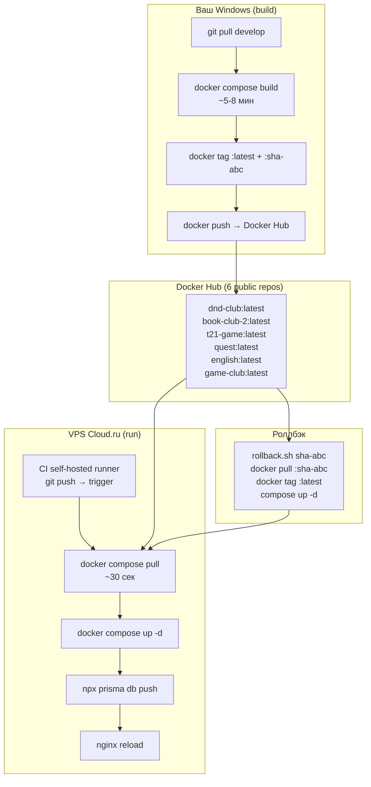

# Container Registry — миграция на готовые образы

> План: билд на локальном Windows, образы в Docker Hub, на VPS только pull + up.
> Ветка: `audit` | Обновлён: 30.06.2026 | Статус: план

---

## Зачем

| Сейчас | После |
|---|---|
| VPS билдит Node 20 + .NET 10 SDK (CPU/RAM 100%) | VPS только тянет готовые образы |
| `docker compose build` на сервере (~5-8 мин) | `docker compose pull` (~30 сек) |
| Нет версионирования образов | Теги `:latest`, `:sha-{commit}` |
| Роллбэк = пересборка старого коммита | Роллбэк = `docker pull` предыдущего тега |
| Простой при деплое до 10 мин | Простой — секунды |

---

## Архитектура



---

## Как это работает

### 1. Сборка — на вашем Windows

```powershell
# build-and-push.ps1
param([string]$Tag = "latest")

$services = @("dnd-club", "book-club-2", "t21-game", "quest", "english", "game-club")

docker login

docker compose -f docker-compose.prod.yml build

foreach ($svc in $services) {
  docker tag "$svc" "perryshe/$svc`:$Tag"
  docker tag "$svc" "perryshe/$svc`:latest"
  docker push "perryshe/$svc" --all-tags
}
```

Запуск: `.\build-and-push.ps1` — тег `latest`  
С SHA: `.\build-and-push.ps1 -Tag "sha-abc123"`

### 2. Деплой — VPS через CI (self-hosted runner)

CI на VPS триггерится `git push` в `develop`.  
Раньше делал `build` — теперь только `pull + up`.

**Файлы для изменения:**

| Файл | Что меняем |
|---|---|
| `docker-compose.prod.yml` | Добавить `image:` + `pull_policy: always` к 6 сервисам |
| `.github/workflows/deploy-v2.yml` | Убрать `docker compose build`, оставить `pull + up` |
| `.dockerignore` | Добавить `apps/english/site/out/` (build output) |
| (новый) `build-and-push.ps1` | Скрипт сборки на Windows |
| (новый) `rollback.sh` | Скрипт роллбэка на VPS |

---

## Шаги

### Шаг 1 — 🔑 Docker Hub: репозитории и логин

| # | Задача | Описание | Файлы |
|---|---|---|---|
| 1 | **Создать 6 публичных репозиториев** | Через hub.docker.com: `dnd-club`, `book-club-2`, `t21-game`, `quest`, `english`, `game-club` | Docker Hub → Repositories → Create |
| 2 | **Залогинить Docker на Windows** | `docker login` | Windows |
| 3 | **Залогинить Docker на VPS** | `docker login` (иначе rate-limit: 100 pulls/6h аноним, 200 — авторизован) | VPS |

**Зависимости:** нет

---

### Шаг 2 — 📦 build-and-push.ps1

| # | Задача | Описание | Файлы |
|---|---|---|---|
| 4 | **Создать скрипт сборки** | PowerShell-скрипт: `git pull`, `docker compose build`, `docker tag`, `docker push` для 6 сервисов. Принимает `-Tag "sha-abc"` | `build-and-push.ps1` |

**Зависимости:** Шаг 1 (логин)

---

### Шаг 3 — 🚀 docker-compose.prod.yml

| # | Задача | Описание | Файлы |
|---|---|---|---|
| 5 | **Добавить `image:` + `pull_policy`** | К каждому сервису (кроме `db`) добавить `image: perryshe/<service>:latest` + `pull_policy: always`. `build:` оставить (для локального билда на Windows) | `docker-compose.prod.yml` |

Пример:

```yaml
services:
  dnd-club:
    build:
      context: .
      dockerfile: apps/dnd-club/Dockerfile
    image: perryshe/dnd-club:latest
    pull_policy: always
```

**Зависимости:** нет

---

### Шаг 4 — 🛠 CI: убрать билд, оставить pull

| # | Задача | Описание | Файлы |
|---|---|---|---|
| 6 | **Обновить deploy-v2.yml** | Убрать шаг `Build app images`. Заменить `docker compose build` → ... оставить `docker compose pull` + `docker compose up -d`. Всё остальное (cleanup, prisma, nginx) без изменений | `.github/workflows/deploy-v2.yml` |

Текущий CI:

```yaml
- name: Cleanup before build
  run: docker stop ...; docker rm -f ...
- name: Build app images                          # ← удалить
  run: docker compose -f docker-compose.prod.yml build ...
- name: Restart app services
  run: docker compose -f docker-compose.prod.yml up -d   # ← не меняется
```

После:

```yaml
- name: Cleanup before build
  run: docker stop ...; docker rm -f ...
- name: Pull and restart                          # ← замена
  run: |
    docker compose -f docker-compose.prod.yml pull
    docker compose -f docker-compose.prod.yml up -d
```

**Зависимости:** Шаг 3 (чтобы `docker compose pull` знал откуда тянуть)

---

### Шаг 5 — 📐 Версионирование + документация

| # | Задача | Описание | Файлы |
|---|---|---|---|
| 7 | **rollback.sh** | Скрипт на VPS: `docker pull perryshe/<service>:sha-abc`, `docker tag` на `:latest`, `docker compose up -d` | `rollback.sh` |
| 8 | **.dockerignore** | Добавить `apps/english/site/out/` (build output не нужен в контексте) | `.dockerignore` |
| 9 | **Документация** | Описать процесс: сборка на Windows → push → CI на VPS → pull + up. Как делать роллбэк | `README.md` |

---

## Итого: 9 задач, 5 шагов

| Шаг | Задачи | Тема |
|---|---|---|
| **1** | 3 | 🔑 Docker Hub repos + логин |
| **2** | 1 | 📦 build-and-push.ps1 |
| **3** | 1 | 🚀 docker-compose: image + pull_policy |
| **4** | 1 | 🛠 CI: убрать build |
| **5** | 3 | 📐 rollback + .dockerignore + docs |

**Статус:** ⬜ — не начато | ✅ — готово | 🔄 — в работе

---

## Особенности

### Prisma generate — фейковые env vars
`prisma generate` требует `DATABASE_URL` в build-time. Dockerfile запускает его **внутри** контейнера после `COPY`, так что проблема решена — `compose build` подхватывает окружение из compose-файла. Для Windows билда это работает так же.

### Docker Hub rate limits
- Анонимный pull: 100 pulls/6h — для 6 образов ~16 деплоев до лимита
- Авторизованный pull: 200 pulls/6h — ~33 деплоя
- **Решение:** `docker login` на VPS (разу навсегда)

### Build context на Windows
`context: .` отправляет весь репозиторий в Docker daemon.  
`apps/english/site/public/audio/*.mp3` (~40MB) — не критично для локального билда, cache решает.

### Deploy trigger
Порядок операций при деплое:
1. `git push` в `develop` — триггерит CI на VPS
2. CI тянет `:latest` образы из Docker Hub и перезапускает
3. После пуша кода — запустить `build-and-push.ps1` на Windows
4. Новые образы будут подтянуты на следующем деплое

**Важно:** если запушить код, но не запустить build-and-push — CI подтянет старые образы.  
Порядок: `git push` + `.\build-and-push.ps1` → CI сделает `pull` → сайт обновлён.
