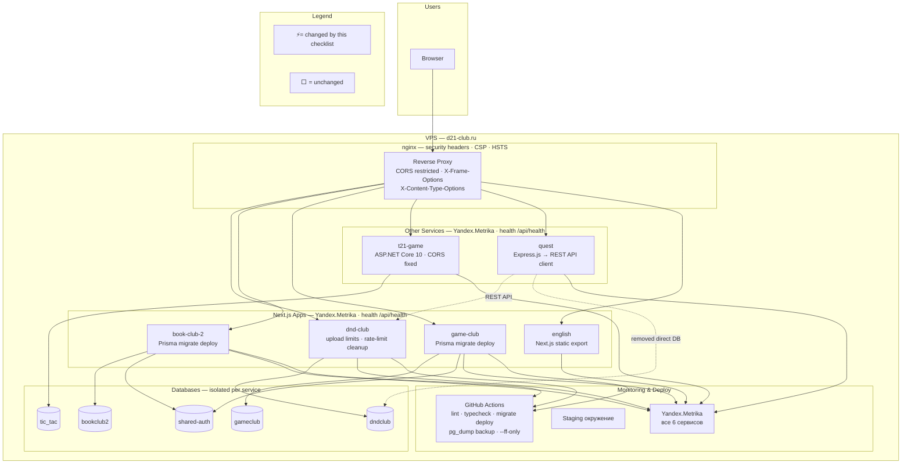

# Аудит и план работ — d21-club.ru

> Единый чек-лист. Каждая задача — законченный функционал для деплоя и теста.
> Ветка: `audit` | Обновлён: 28.06.2026 | Мерж: `develop` догнал до `6fdce5e`

---

## Шаг 1 — 🔴 Безопасность: секреты и entrypoint

| # | Задача | Описание | Файлы | Готовность |
|---|---|---|---|---|
| 1 | **Вынести секреты в `.env`** | `POSTGRES_PASSWORD`, `NEXTAUTH_SECRET`, `ADMIN_PASSWORD` + **game-club** secrets из docker-compose в `.env.prod`. Сгенерировать новые значения для всех секретов | `docker-compose.yml`, `docker-compose.prod.yml`, `.env.prod` | ⬜ |
| 2 | **Исправить entrypoint скрипты** | Убрать seed из `apps/book-club/docker-entrypoint.sh` (перезаписывает админа и кампании при каждом рестарте). **book-club-2** и **dnd-club** — уже почищено в develop ✅. **game-club** — чистый, без seed в entrypoint ✅ | `apps/book-club/docker-entrypoint.sh` | ⬜ |

**Зависимости:** нет

> **Заметка:** book-club удалён из `docker-compose.prod.yml`, но остаётся в `docker-compose.yml` (dev). Seed-фикс нужен для локальной разработки.
> **english (e21):** не использует БД/auth — у него нет секретов, но `NODE_ENV` и `NEXT_TELEMETRY_DISABLED` должны уйти в `.env` общей структурой.

---

## Шаг 2 — 🔴 Безопасность: CORS, CSP, headers, uploads

| # | Задача | Описание | Файлы | Готовность |
|---|---|---|---|---|
| 3 | **Настроить CORS, CSP и security headers** | CORS tic-tac: `AllowAnyOrigin` → `WithOrigins("https://d21-club.ru")`, CSP `https:` → конкретные домены (добавить `d21-club.ru`, `mc.yandex.ru` для Метрики, убрать `https:`). Добавить HSTS, X-Frame-Options, X-Content-Type-Options. **game-club** (g21) — добавить в CSP | `apps/tic-tac/tic_tac/Program.cs:99-102`, `dnd-club-nginx.conf` | ⬜ |
| 4 | **Добавить лимиты: upload + rate-limit** | Проверка размера файлов при загрузке, cleanup устаревших записей в rate-limit (memory leak). **game-club** — проверить на те же проблемы | `apps/dnd-club/src/lib/admin-actions.ts:35`, `apps/dnd-club/src/lib/rate-limit.ts`, `apps/game-club/src/lib/*` | ⬜ |

**Зависимости:** нет

---

## Шаг 3 — 📊 Аналитика (Яндекс.Метрика)

| # | Задача | Описание | Файлы | Готовность |
|---|---|---|---|---|
| 5 | **Яндекс.Метрика в Next.js приложения** | Компонент Analytics + layout.tsx для dnd-club, **book-club-2**, **game-club** + env `NEXT_PUBLIC_YM_COUNTER` + CSP под Метрику. **Примечание:** book-club (старый b21) удалён из prod compose — не добавлять | `apps/*/src/components/Analytics.tsx`, `apps/*/src/app/layout.tsx`, `docker-compose.prod.yml`, `dnd-club-nginx.conf` | ⬜ |
| 6 | **Яндекс.Метрика на статических страницах** | **english** теперь Next.js — счётчик через Analytics в `layout.tsx` (как остальные Next.js app). Статика: `tor.html` (apps/english/site/public), quest-app, tic-tac | `apps/english/site/src/app/layout.tsx`, `apps/english/site/public/tor.html`, `apps/Quest/quest-app/public/index.html`, `apps/tic-tac/tic_tac/wwwroot/index.html` | ⬜ |

**Зависимости:** Шаг 1 (env), Шаг 2 (CSP)

---

## Шаг 4 — 🗄️🔄 Разделение БД + Prisma миграции

| # | Задача | Описание | Файлы | Готовность |
|---|---|---|---|---|
| 7 | **Доделать разделение БД** | book-club-2 → `bookclub2` ✅, game-club → `gameclub` ✅ (уже сделано в develop). Осталось: отвязать Quest от `dndclub` (прямые SQL-запросы), отвязать t21-game от `dndclub` (ClubConnection), перенести auth-таблицы из `dndclub` в отдельную БД `auth` для всех сервисов, добавить `sadmin` в enum | `apps/Quest/quest-app/server.js`, `docker-compose.prod.yml`, `postgres/init.sql` | ⬜ |
| 8 | **Перевести на Prisma миграции** | Сгенерировать `prisma migrate dev` для **dnd-club**, **book-club-2**, **game-club**. CI: заменить `db push` → `migrate deploy` для всех 3 (`deploy-v2.yml:45-51`) | `apps/*/prisma/`, `.github/workflows/deploy-v2.yml:45-51` | ⬜ |

**Зависимости:** нет, но требует тестирования всех сервисов после деплоя

> **Заметка:** develop уже содержит 3 отдельные БД: `dndclub` (dnd-club + auth всех сервисов), `bookclub2` (book-club-2), `gameclub` (game-club). После разделения auth в отдельную БД останется: `dndclub` → только dnd-club data.

---

## Шаг 5 — 🛠 CI/CD

| # | Задача | Описание | Файлы | Готовность |
|---|---|---|---|---|
| 9 | **Улучшить CI/CD пайплайн** | Добавить lint + type-check в CI, заменить `git pull` на `git pull --ff-only`, добавить `pg_dump` перед деплоем. **Уже в develop:** cleanup перед сборкой ✅, параллельный `db push` для 3 Next.js приложений ✅. **Осталось:** `db push` → `migrate deploy` (в Шаге 8), `git pull` → `--ff-only`, добавить lint/typecheck | `.github/workflows/deploy-v2.yml` | ⬜ |

**Зависимости:** Шаг 4 (`db push` → `migrate deploy`)

---

## Шаг 6 — 🏗 Auth: централизация

| # | Задача | Описание | Файлы | Готовность |
|---|---|---|---|---|
| 10 | **Централизовать аутентификацию** | Выделить общий `auth.ts` в shared-пакет для 3 Next.js app (dnd-club, book-club-2, game-club) — сейчас 3 независимые копии с риском рассинхронизации. **book-club** (старый) — не трогать, он только в dev | `apps/*/src/lib/auth.ts`, `packages/club-nav/` | ⬜ |

**Зависимости:** Шаг 4 (чтобы не делать две реорганизации сразу)

---

## Шаг 7 — 🏗 Quest: отвязка от общей БД

| # | Задача | Описание | Файлы | Готовность |
|---|---|---|---|---|
| 11 | **Отвязать Quest от общей БД** | REST API в dnd-club: `GET /api/characters?campaign=dead-band`, Quest: заменить `pool.query()` на fetch к этому API | Новый route в dnd-club, `apps/Quest/quest-app/server.js:42-84` | ⬜ |

**Зависимости:** Шаг 4 (чтобы Quest получал данные через API, а не из чужой БД)

---

## Шаг 8 — 📈🚀 Observability + Deployment

| # | Задача | Описание | Файлы | Готовность |
|---|---|---|---|---|
| 12 | **Health checks и zero-downtime deploy** | endpoint `/api/health` в каждый сервис, health checks в docker-compose, убрать maintenance window. **english (e21):** статический экспорт, `/api/health` не добавить — health check через TCP-порт (3005) | `docker-compose.prod.yml`, `maintenance.sh`, `deploy-v2.yml` | ⬜ |
| 13 | **Staging, мониторинг и алерты** | Staging-окружение, структурированные логи (JSON), uptime-мониторинг + алерты | — | ⬜ |

**Зависимости:** Шаг 7 (после архитектурной стабилизации)

---

---

## Архитектура после внедрения (checklist.md)

**Ключевые изменения:**
- **Quest** — больше не ходит напрямую в БД dndclub, только через REST API dnd-club
- **auth** — выделен в отдельную БД `shared-auth`, единый пакет для 3 Next.js приложений
- **english** — переехал с nginx-static на Next.js (node:20-alpine, monorepo build)
- **Analytics** — Yandex.Metrika на всех 6 сервисах
- **Security** — CSP без `https:` wildcard, CORS ограничен, HSTS, upload-лимит
- **CI** — `db push` → `migrate deploy`, добавлены lint + typecheck, `pg_dump` перед деплоем, `--ff-only`
- **Deploy** — health checks, zero-downtime (без maintenance.html)
- **Staging** — отдельное окружение для тестирования

---

## Итого: 13 задач, 8 шагов

| Шаг | Задачи | Тема |
|---|---|---|
| **1** | 2 | 🔴 Секреты + entrypoint |
| **2** | 2 | 🔴 CORS/CSP/headers + лимиты |
| **3** | 2 | 📊 Аналитика Next.js + статика |
| **4** | 2 | 🗄️🔄 Разделение БД + миграции |
| **5** | 1 | 🛠 CI/CD |
| **6** | 1 | 🏗 Auth централизация |
| **7** | 1 | 🏗 Quest отвязка |
| **8** | 2 | 📈🚀 Health/deploy + staging/monitoring |

> **После мержа develop (28.06):** book-club (старый) удалён из prod compose | Добавлены game-club (g21) + english (e21, теперь Next.js, не nginx-static) | book-club-2 переехал на `bookclub2` | dnd-club и book-club-2 entrypoint'ы почищены | CI обновлён (cleanup, parallel db push)

**Статус:** ⬜ — не начато | ✅ — готово | 🔄 — в работе
